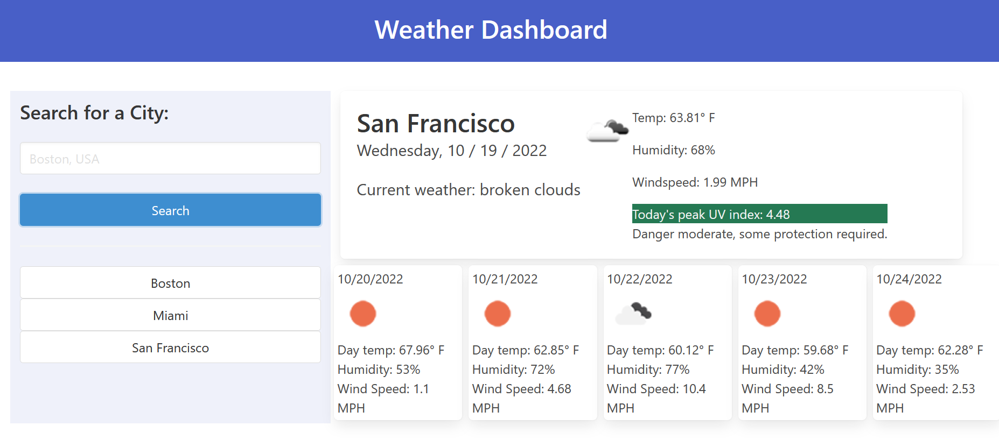

# Simple Weather Dashboard  
  
## Description  
This is a simple weather dashboard using OpenWeather's API to retrieve and display current weather, and the next 5 days' forecast.   
[GitHub Pages](https://jaquelrey.github.io/Simple-Weather-Dashboard/)   

## Table of Contents  
* [Details](#details)  
       * [Features](#features)  
       * [Technologies](#technologies)  
* [Contributing](#contributing)  
* [Questions](#questions)  
* [Credits](#credits)  
----  
## Details  
### Features  
Features required for this project were dynamically updated HTML and CSS  
### Technologies  
jQuery was used, because I guess that's what I started with months ago. Bulma is used for the styling. I also used Geocode's API to fetch latitude and longitude of user queries.  
## Contributing  
I need to refactor this code- it's old and certainly not to par with my current standard. That being said, I'm not taking feedback until I do so.  
## Questions  
  
>Got questions? Reach out to me at:  
>My [Github](https://github.com/JaquelRey)  
>Email: [jaquelrey@gmail.com](mailto:jaquelrey@gmail.com)  
  
----  
  ## Credits  
### Authors  
I worked on this alone  
